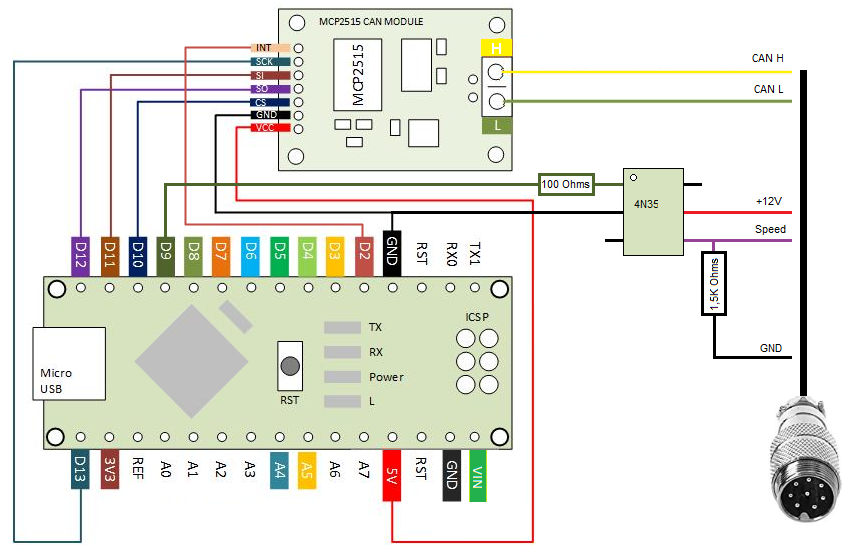

# Control_Amatron
Section control of Amatron by AgOpenGPS

Section control of Amatron for the Arduino Uno/Nano and the MCP2515 to use with AgOpenGPS. Pulse emulation for GPS speed.
Use this lib https://github.com/coryjfowler/MCP_CAN_lib and https://bitbucket.org/teckel12/arduino-new-tone/wiki/Home
. Using newTone() over tone() because it solves problems with frequencies below 31Hz, which generated speed errors at low speeds. This library has many other advantages...

# Software
Since the spreader cannot change position quickly, the code is made so that the changes are not abrupt. Therefore I recommend some adjustment in AOG, an opening advance at least 2,5s and closing 0.2s and an overlap between 50% and 80%. At least that's what worked best for me.

# Hardware

The resistance of 1.5K Ohms can be decreased up to 1K Ohms

CAN H and CAN L must be connected by you. the two pin shown are not normally used on any enclosures or leads. it is therefore easy to use them for a quick connection and easy

You can also use an HC-05 ansi there is nothing to connect to the tablet.

